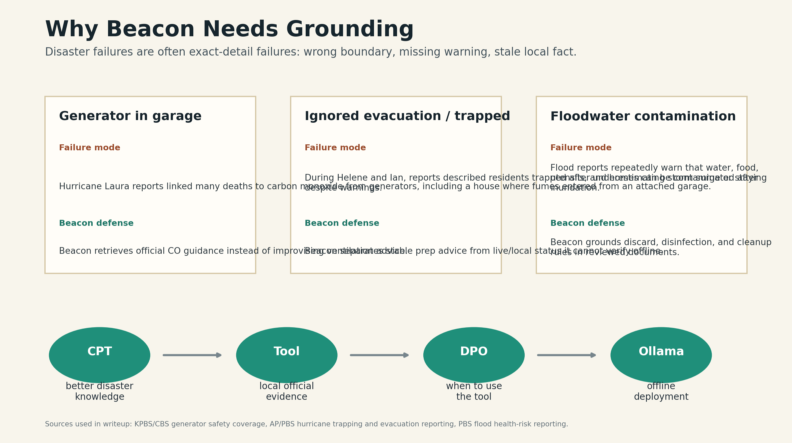
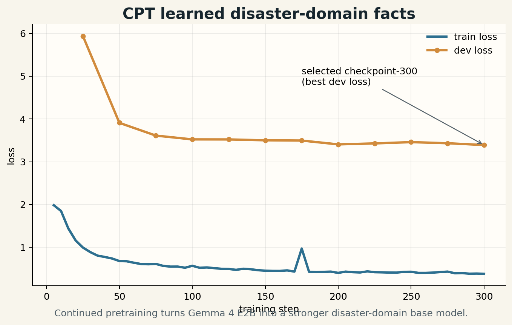
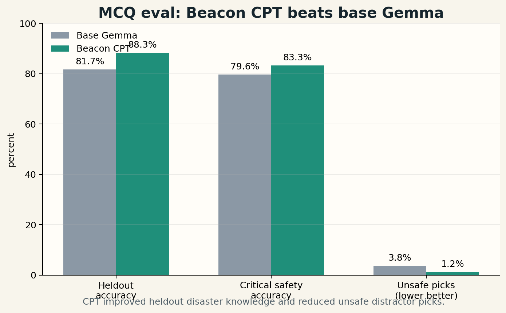
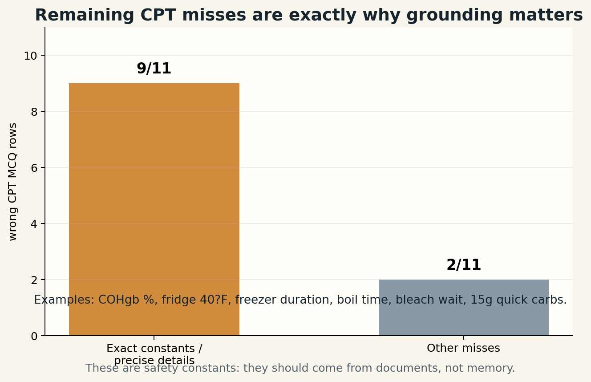
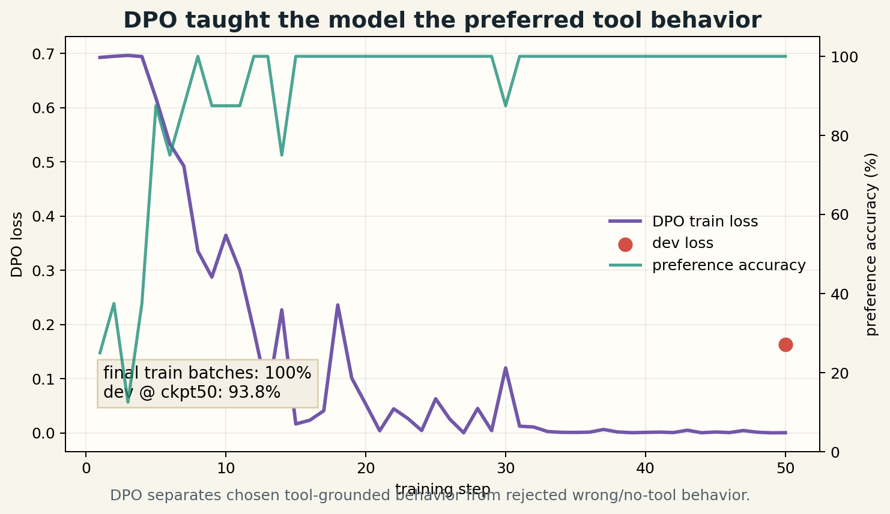
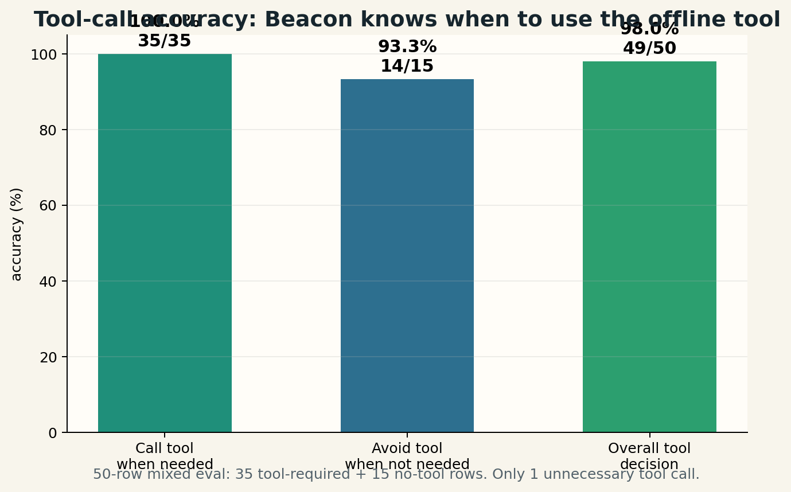

# Beacon: Offline Disaster Guidance With Gemma 4

## Subtitle

A phone-first, offline Gemma 4 E2B system that learns disaster knowledge, retrieves local official guidance, and gives grounded crisis advice when cloud access may fail.



## The Story

Disasters punish approximate advice. People do not just need a chatbot that sounds calm; they need the right boundary at the right moment. Can a generator run in a garage if the door is open? Should floodwater-touched baby bottle nipples be sanitized or discarded? Is a local road safe right now, or is that a live fact an offline model cannot know?

Real incidents show why this matters. [KPBS reported](https://www.kpbs.org/news/2020/09/01/majority-of-hurricane-laura-deaths-linked-to) that a majority of Hurricane Laura's confirmed deaths were linked to generator carbon-monoxide poisoning, including five people in one house after fumes entered from an attached garage. [CBS News](https://www.cbsnews.com/news/hurricane-generators-can-be-deadly-safety-tips/) later highlighted the same recurring pattern: people survive the storm, then die from unsafe generator use. [AP/PBS coverage of Hurricane Ian](https://www.pbs.org/newshour/nation/people-trapped-and-over-2-million-without-power-as-ian-drenches-florida) described people trapped in flooded homes and millions without power. [PBS health reporting after Helene](https://www.pbs.org/newshour/health/in-mountain-areas-flooded-by-hurricane-helene-these-health-risks-are-rising) emphasized how floodwater contamination is often invisible but dangerous.

Beacon exists for that gap: practical disaster questions where a fluent generic answer is not enough.

## Why Offline, Why Gemma 4 E2B

Beacon is an offline-first app. The current working deployment runs through Ollama on our laptop, but the product target is phone-class local use: something a person can carry during a flood, outage, cyclone, or evacuation. That is why we chose Gemma 4 E2B instead of a larger model. A bigger model might score better in the cloud, but it would miss the point if it cannot run for the people who need it when networks are down.

In disasters, internet access, power, and centralized infrastructure can fail first. A smaller local model is not a compromise here; it is the deployment strategy.

## What We Built

| Layer | Purpose | Why it matters |
| --- | --- | --- |
| Gemma 4 E2B IT | Compact instruction base | Practical path to offline laptop and future phone deployment |
| Continued pretraining | Learn disaster-domain facts | Improves raw factual power over base |
| Offline document tool | Retrieve official guidance | Exact details come from sources, not memory |
| DPO tool-use adapter | Learn when and how to use tools | Reduces skipped tools, wrong tools, and unsupported answers |
| Beacon controller | Owns prompt, parsing, citations, tool loop | Makes the model usable as a grounded app |

The runtime flow is simple:

```text
question -> Ollama/Gemma -> optional search_official_docs
         -> optional read_official_doc -> cited answer
```

## The Data And CPT Win

We gathered disaster-specific material from Indian and global public-health, weather, and emergency-management sources. The continued-pretraining package had:

| Corpus item | Count |
| --- | ---: |
| Source documents | `233` |
| Training-ready rows | `1,415` |
| Estimated tokens | `2,131,792` |
| Train/dev/test rows | `1,361 / 23 / 31` |

Continued pretraining gave us the first proof point: Gemma became better at disaster facts.

| Evaluation | Base Gemma | Beacon CPT ckpt-300 | Win |
| --- | ---: | ---: | --- |
| Source-QA partial/correct | `23.7%` | `36.7%` | Better factual coverage |
| Source-QA strict correct | `8.5%` | `15.0%` | Better exact answers |
| Heldout MCQ accuracy | `81.67%` | `88.33%` | Strong heldout lift |
| Critical safety MCQ | `79.63%` | `83.33%` | Safer disaster behavior |
| Unsafe distractor selected | `3.75%` | `1.25%` | Fewer dangerous choices |





The key observation was that `9` of the `11` remaining CPT MCQ mistakes were exact-number or precise-detail problems: COHgb percentage, refrigerator temperature, freezer duration, boil time, bleach wait time, or quick-carb grams. That is not a failure of the idea; it is the reason grounding is necessary. A disaster assistant should not memorize every bleach ratio, food discard rule, generator boundary, medicine-storage rule, or evacuation nuance. Those details should be retrieved from reviewed documents.



## The Grounding Layer

Beacon's offline tool package contains:

| Retrieval corpus | Count |
| --- | ---: |
| Official/reputable documents | `30` |
| Searchable sections | `284` |
| India-specific documents | `4` |
| Global documents | `4` |
| Stable US/global-applicable fallback docs | `22` |

The tool covers floodwater, power outage, carbon monoxide, food safety, water safety, medicine disruption, diabetes, cyclone, lightning, shelter hygiene, and route-status uncertainty. Fallback sources are used only for stable public-health constants and generic safety boundaries, not live local status.

This is where Beacon clearly separates from base Gemma. Base Gemma answers from memory. Beacon can search offline documents, read the relevant section, cite the source, and say when static documents cannot prove a live/local fact.

## DPO: Teaching Tool Judgment

After CPT and retrieval, we created a DPO preference dataset:

| DPO item | Count |
| --- | ---: |
| Preference pairs | `2,368` |
| Train/dev/final-eval | `1,898 / 229 / 241` |
| No-tool-needed examples | `440` |

The pairs rewarded the behavior we wanted: call the tool for exact official guidance, avoid the tool for simple questions, search with exact hazard keywords, read before making precise claims, refuse unsupported live/local facts, and avoid unsupported final answers. The DPO curve showed the preference loss dropping quickly, with tool-use preference accuracy reaching `100%` on the final training batches and `93.75%` on the checkpoint-50 dev evaluation.



The actual tool-loop behavior was even more important. On a 50-row mixed eval with `35` tool-required rows and `15` no-tool rows, Beacon made the correct tool decision on `49/50` examples. It called the tool on `35/35` rows that needed retrieval, and avoided the tool on `14/15` rows that did not.



Current lineage:

```text
Gemma 4 E2B IT
  -> Beacon CPT checkpoint-300
  -> Beacon Tool DPO CPT Fullprompt checkpoint-50
```

## Beacon Wins

| Scenario | Generic model risk | Beacon win |
| --- | --- | --- |
| Generator in attached garage, door open | May say ventilation is enough or give vague advice | Retrieves CO guidance and gives the hard boundary |
| Floodwater touched infant feeding items | May improvise cleaning advice | Grounds discard/safety rule in official docs |
| Food after outage/flood | May rely on smell/appearance | Uses documented discard rules |
| Live road or shelter status | May hallucinate local facts | Says offline docs cannot verify live status |
| Basic preparedness question | Tool overuse would be annoying | DPO includes no-tool cases so Beacon can answer directly |

This is the product claim: CPT beats base Gemma in raw disaster knowledge; grounding fixes the exact-detail failure mode; DPO teaches the model to use that grounding effectively. Together, Beacon is clearly better than base Gemma for grounded disaster guidance.

## Deployment

Beacon currently deploys through Ollama on our laptop as `beacon-gemma4-current-best` with a `q4_k_m` GGUF export. Ollama runs the model; the Beacon controller owns the system prompt, offline retrieval index, tool loop, parsing, and citations.

This laptop deployment is the proof that the stack can run locally. The intended product direction is a phone-specific app: small enough to carry, offline enough to survive network loss, and grounded enough to avoid dangerous guessing.

## Submission Assets

- Public code repository: attach in Project Links.
- Live demo: attach URL or runnable files.
- Video: attach public YouTube link, under 3 minutes.
- Media gallery: attach cover image plus the grounding, CPT, MCQ, DPO, and tool-call accuracy visuals.
- Technical artifacts: `reports/beacon_mcq_knowledge_v1/`, `data/preference_dpo/beacon_tool_use_dpo_v1_curated/`, `config/beacon_current_model.json`, and the Kaggle report dataset.
